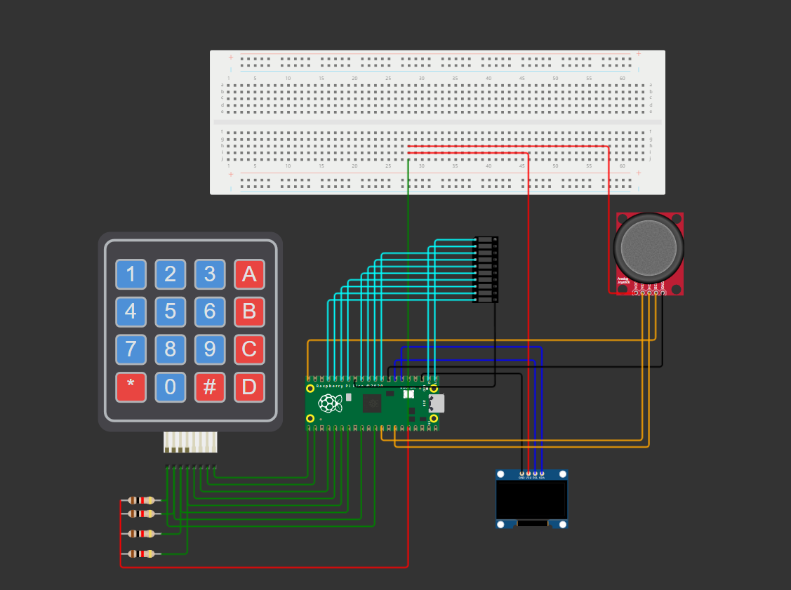

Inspirational Quote Generator Raspberry Pi Pico Project

This project is an Inspirational Quote Generator built using a Raspberry
Pi Pico, a 4x4 Keypad, an OLED display, an LED bar, and a joystick. It
allows users to choose from various categories of motivational quotes
and displays a quote based on their selection, offering an interactive
and uplifting experience.

Key Features:
    - Category Selection: The system begins by displaying four
categories of quotes on the OLED display, labeled A, B, C, and D. Each
category represents a different type of inspirational message (Success,
Happiness, Motivation, Positivity). The user must press a key on the
keypad (from A to D) to select the desired category.  
    - Quote Selection: After selecting a category, the OLED display 
prompts the user to \"Choose a number\" between 0 and 9. The user then presses 
a number key on the keypad to select a specific quote from the chosen category.  
    - Displaying the Quote: Once a number is selected, a random inspirational
quote from the corresponding category appears on the OLED display.  
    - The LED bar lights up briefly, adding a visual cue to the experience
when a quote is displayed.  
    - Switching Categories: If the user moves the joystick to the far right, 
the system resets, allowing the user to choose a different category and explore another quote.

This project was a great opportunity to work with various components,
including the Raspberry Pi Pico, OLED display, keypad input, and
joystick control. It helped me learn how to handle user input via both a
keypad and joystick, manage state transitions between different displays
(categories, numbers, quotes), and work with an OLED display for clear
output. Additionally, incorporating the LED bar for feedback added an
extra layer of interactivity.

Check out the project simulation here
https://wokwi.com/projects/406368310009237505.

Here is a photo of the layout:

